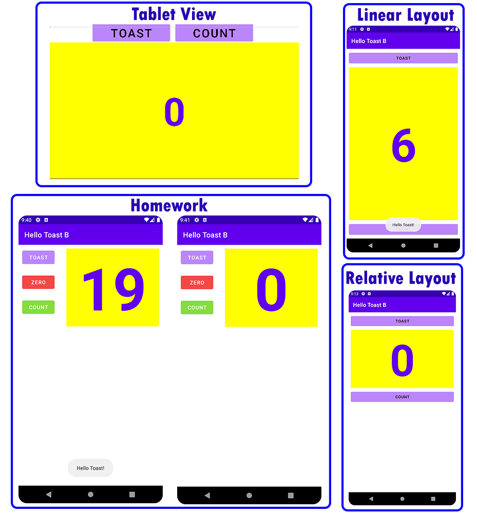

# android-layout-part-b

Pemrograman Mobile - Pertemuan 3

Melakukan praktikum The Layout Editor pada mobile program menggunakan Java.
  - Creating Layout Variants
  - Linear Layout
  - Relative Layout
  - Homework

